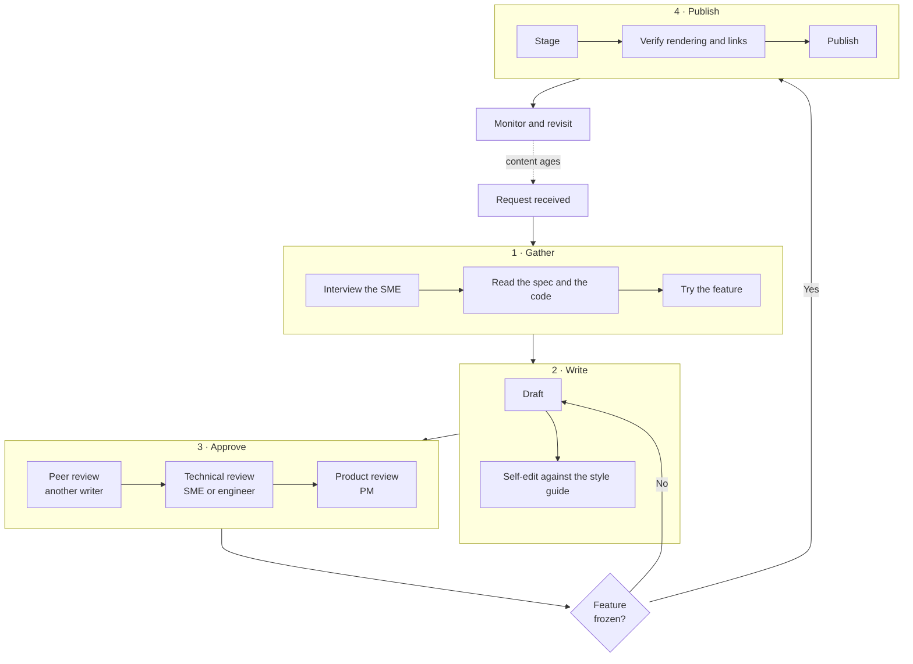

# How Documentation Work Actually Moves

A process model built for an engineering org that kept asking the documentation
team the same question: what happens after I file a request?

**Role:** I built this model and the workshop canvas it came from.
**Original format:** a large collaborative whiteboard canvas.
**Type:** Process and information-flow modeling.

---

## Why it exists

Engineers and product managers could see documentation appear, but the work between
the request and the published page was opaque to them. That opacity produced two
recurring problems: requests arrived at the wrong stage to be useful, and reviewers
were surprised to be reviewers.

The model below made the pipeline visible, named who owns each stage, and marked the
points where work actually stops and waits for someone.

## The pipeline

## Who owns what

| Stage | Owner | What they decide |
|---|---|---|
| Gather | Writer | Whether there is enough information to start |
| Write | Writer | Structure, scope, and level of detail |
| Peer review | Another writer | Clarity, consistency with the rest of the corpus |
| Technical review | SME or engineer | Factual accuracy |
| Product review | Product manager | Whether it describes the shipped behavior |
| Publish | Writer | Timing relative to the release |
| Monitor | Writer | When a page needs revisiting |

## The parts people got wrong

**Three reviews, not one.** Peer, technical, and product review answer different
questions, and collapsing them is how factually correct documentation ships that
nobody can follow. Naming them separately set the expectation that each reviewer
reads for their own thing.

**The feature freeze is a real gate.** Documentation written against a moving
feature gets rewritten. The loop back to drafting is in the diagram because it
happened constantly and was previously treated as a writer's failure rather than a
predictable consequence of starting too early.

**Publishing is not the end.** The dotted line back to the start is the part most
process diagrams leave off. Content ages, and a pipeline that ends at "publish"
produces a corpus nobody maintains.

---

## Notes on this sample

Rebuilt as a diagram from the original workshop canvas. Company and product names
removed. The stages, owners, and gates are unchanged.

Related: [Scoring pages for freshness](page-freshness-scoring.md) — the tooling
behind the "monitor and revisit" stage above.
