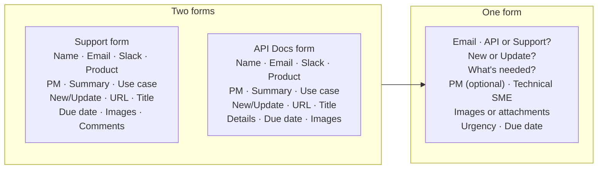

# Consolidating Two Intake Forms Into One

Two documentation request forms asked for different things, neither of them
complete. This is the field-by-field analysis that merged them into a single form,
with a reason recorded for every field kept, cut, or added.

**Role:** I did this analysis and designed the resulting form.
**Type:** Information architecture / content modeling.
**Companion piece:** [Work Intake Automation](../systems-and-tooling/work-intake-automation.md) — the automation this form feeds.

---

## The problem

Support content and API documentation each had their own request form. They had
been written at different times by different people, and they had drifted:

- The support form asked for the product; the API form asked for it differently.
- Both asked for a summary *and* a use case, which requesters filled with the same
  text twice.
- Neither reliably captured whether the request was new content or an update to
  something existing, so every request started with someone asking.
- Neither captured urgency, so everything was implicitly urgent.
- Fields that could be derived from the submitter's email were being typed by hand.

Two forms also meant two queues, two sets of conventions, and no single view of
what documentation work was outstanding.

## What changed

## Field decisions

| Field | Decision | Reason |
|---|---|---|
| Name, Slack user, Jira user | **Removed from the form** | All derivable from the submitted email address. Asking a person to type what the system already knows is a tax on the requester and a source of typos. |
| Product | **Removed** | Only one product existed. The question had a single possible answer. |
| Summary + Use case | **Merged into "What's needed?"** | Requesters filled both with the same text. Two boxes asking one question produces worse answers than one box. |
| API or Support? | **Added** | This is the actual routing decision, and it was previously encoded in *which form you found* rather than something anyone answered. |
| New or Update? | **Kept, made required** | Determines whether the work starts from a blank page or an existing URL. The single most useful field for estimating effort. |
| Link to existing content | **Kept, conditional** | Only appears when the answer above is "Update." |
| Suggested title | **Removed** | The documentation team decides titles based on the content, not the requester. Asking implied otherwise and created a negotiation that did not need to exist. |
| PM for this feature | **Kept, optional** | Useful when it exists, absent often enough that requiring it would block submissions. |
| Technical contact / SME | **Added** | The person who can answer questions is frequently not the requester. Not asking meant finding out later, mid-draft. |
| Images or attachments | **Kept, as a link** | The automation could not attach files to tickets directly, so attachments are stored and linked instead. A constraint of the system, documented rather than hidden. |
| Urgency | **Added as a choice** | Three options rather than a free-text date. Making the requester pick between "less than 2 weeks (urgent)," "more than 2 weeks," and a specific date turns urgency into a real signal instead of a default. |
| Due date | **Kept, conditional** | Only when a specific date is genuinely required. |
| Additional comments | **Removed** | Folded into "What's needed?" A general comments box collects the information that belonged in a real field, which is how fields go unused. |

## The idea underneath

The old forms asked what the documentation team wanted to know. The new form asks
what only the requester can answer, and derives or decides the rest.

Every field removed had a specific reason: derivable from something else, answerable
by one party only, or duplicating a question already asked. That reasoning is
recorded here because a form without it drifts back within a year, which is how
there came to be two forms in the first place.

Making urgency a choice with visible tradeoffs was the change that mattered most.
It converted an unstated assumption — everything is urgent — into a decision the
requester makes knowingly.

---

## Notes on this sample

Names, product names, and internal links have been removed. The field analysis and
the reasoning are unchanged.
