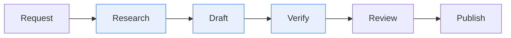
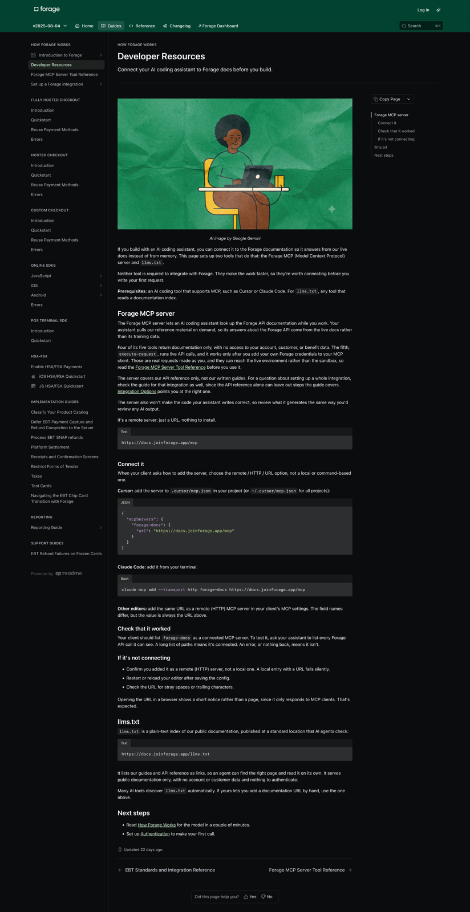
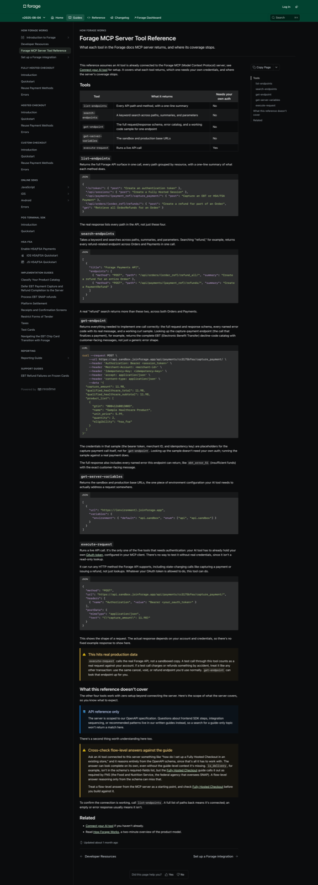
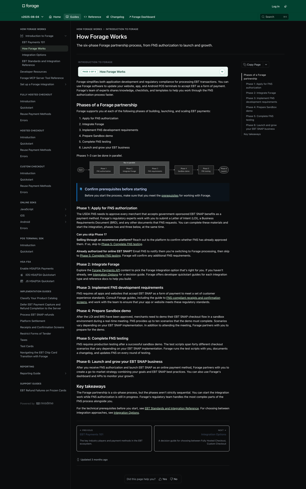

# Building a documentation system, not writing documentation

How I directed an AI-assisted pipeline that rebuilt Forage's developer docs, restructured 135 pages under a real information architecture, and shipped a documentation MCP server and llms.txt for AI coding assistants.

## Role, period, what this is

I was a Documentation Engineer at Forage, a payments company that processes SNAP/EBT and HSA/FSA transactions for platforms and merchants. By 2026 my actual job was not writing docs. It was directing and building the system that produced them.

That distinction is the point, not a caveat. Roughly 65 to 75 percent of my time went into tooling: building and running a multi-stage pipeline where AI did the research, drafting, and verification, under my direction and review. I selected the framework, designed the pipeline, built the tools, and checked the output. I did not personally draft the final published pages. Directing an AI-assisted system to produce accurate, well-structured technical docs at scale is the skill. This case study is about that system.

## The problem

Forage's docs had grown the way most docs grow: page by page, as features shipped, with no structural discipline holding them together. Guides and API reference blurred together. Some pages tried to be both a tutorial and a lookup table at once, which serves neither reader well. A developer integrating EBT payments couldn't tell, from the page title alone, whether they'd land on a walkthrough or a spec.

At the same time, a new category of reader showed up: AI coding assistants. Cursor, Claude Code, and similar tools were increasingly the first thing a developer pointed at our docs, and they needed something different from a human skimming a page. They needed structure they could parse and an index they could crawl.

Two audiences, one set of docs, neither well served by the old structure.

## What was built

**The pipeline.** I built a roughly 20-stage documentation pipeline: intake a change or a doc request, research the actual behavior against source material, draft, run structure and voice checks, verify factual claims against the codebase, route for subject-matter review, then publish. It's been run 61 times. Each stage is a discrete, auditable step, not one black-box prompt. That's what let me review the process instead of just trusting the output.

Research, drafting, and verification are AI-assisted stages, run under my direction. Review and publish are human decision points.

**The Diátaxis restructure.** I researched documentation framework options independently and picked Diátaxis, which separates content into four clear types: tutorials, how-to guides, reference, and explanation. I implemented it across the corpus myself. Seven full guide sets were rebuilt under the new structure. About 42 of roughly 110 guide and reference pages were restructured. A dedicated audit-and-split tool, which flags pages mixing types and proposes how to split them, has been run 203 times.

**llms.txt and the MCP server.** Two artifacts built specifically for AI readers, covered in detail below.

## Why machine-readable docs matter now

This is the forward-looking part, and it's worth taking seriously: docs increasingly have two audiences, developers and the AI tools developers use, and those tools need different things than a person reading in a browser.

**llms.txt** is a plain-text index published at `docs.joinforage.app/llms.txt`. It lists every guide and reference page as a link with a one-line description, so an AI agent can find the right page without crawling the whole site. Many tools now check for this file automatically. Every page also supports a `.md` suffix for a clean markdown version, no HTML stripping required.

**The Forage MCP server** goes further: it lets a connected AI coding assistant query the API documentation directly while a developer works, instead of relying on training data that might be stale or wrong. It exposes five tools. Four are read-only lookups: list every API endpoint, search endpoints by keyword, get the full schema and error catalog for one endpoint, and get the sandbox and production base URLs. The fifth, `execute-request`, runs a live API call using the developer's own credentials.

I built the MCP tool-set documentation on the developer-resources page, and the skill that generated its hero image. The MCP Tools Reference page itself, cataloging what each of the five tools returns and where their coverage stops, is confirmed live and part of the system I directed. That reference does something most tool docs skip: it states plainly where the tools *don't* help. The API reference tools only know the OpenAPI schema, so a question about integration sequencing or a required field that lives only in a guide (not the schema) can get a confidently wrong answer from an AI reasoning off the server alone. The docs say so directly, and point back to the guide.

That's the real shift. Publishing docs for AI consumption isn't just a markdown export. It means being honest, in the docs themselves, about where a tool's knowledge runs out.

## Decisions worth explaining

**Picked Diátaxis over a custom taxonomy.** Diátaxis is a known, well-reasoned framework with a clear test for where any given piece of content belongs: is the reader learning, doing, looking something up, or trying to understand why. A custom scheme would have taken longer to build and would have needed onboarding for every new contributor. Diátaxis had documentation of its own.

**Made verification a separate pipeline stage from drafting.** Drafting and fact-checking use different failure modes. A draft can read well and still get an error code wrong. Splitting verification into its own stage, checked against the actual codebase rather than the draft's own claims, catches that class of error before it reaches review.

**Wrote the MCP reference to name its own blind spots.** It would have been easy to just list what the five tools return and stop there. Instead the reference tells the reader exactly when a flow-level question needs the guide instead of the API schema, using a concrete example: `is_delivery` isn't a required field in the schema, but FNS (the Food and Nutrition Service, which oversees SNAP) requires it for certain checkouts, and only the guide says so.

**Split docs into guides and API reference, not just "docs."** Two different jobs: a guide teaches a workflow, a reference answers a specific lookup mid-build. Mixing them meant either type of reader had to skim past the other type's content to find what they needed.

**Built the audit tool before doing the restructure by hand.** Running a tool 203 times to flag type-mixing across the corpus is a different scale of work than eyeballing 135 pages. The tool made the restructure something I could direct and check, rather than something I had to do page by page myself.

**Kept `execute-request` explicit about hitting production.** The MCP server's four lookup tools are safe to explore freely. The fifth runs real transactions against live payment data. The docs call that out with a direct warning rather than assuming a developer will read the fine print, because a wrong assumption there costs real money, not just wasted time.

## What it looks like

*Developer Resources. The hero image was generated by a skill I built.*

*MCP Tools Reference, including the section naming where the tools stop helping.*

*An explanation page under the Diátaxis restructure.*

## Verify it yourself

- Live site: [docs.joinforage.app](https://docs.joinforage.app)
- Developer Resources (MCP server + llms.txt setup): [docs.joinforage.app/docs/developer-resources](https://docs.joinforage.app/docs/developer-resources)
- MCP Tools Reference: [docs.joinforage.app/docs/mcp-tools-reference](https://docs.joinforage.app/docs/mcp-tools-reference)
- Machine-readable index: [docs.joinforage.app/llms.txt](https://docs.joinforage.app/llms.txt)
- Any page as markdown: append `.md` to its URL, e.g. [docs.joinforage.app/docs/authentication.md](https://docs.joinforage.app/docs/authentication.md)
