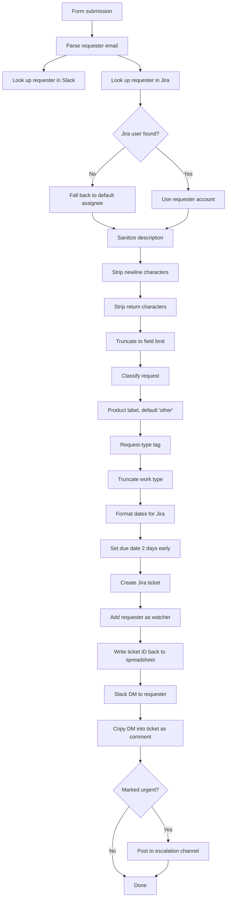

# Documentation Work Intake Automation

A 23-step automation that turned an unstructured documentation request queue into
tracked, routed, acknowledged work items — with no manual triage.

**Role:** I designed and built this. **Tools:** Google Forms, Zapier, Jira, Slack.
**Type:** Internal tooling for a documentation team.

---

## The problem

Documentation requests arrived by Slack message, email, hallway conversation, and
occasionally a Jira ticket someone filed themselves. There was no single queue, no
consistent set of required fields, and no acknowledgement to the requester. Two
separate intake forms existed — one for support content, one for API docs — and
they asked for different things, neither of them complete.

Three consequences followed. Work got lost. Requests arrived without the
information needed to start them, so every one began with a round of questions.
And nobody outside the team could see what was queued or where it stood.

## What it does

One form feeds the automation. The automation does the rest: it identifies the
requester across three systems, cleans the submitted text so it fits Jira's field
constraints, classifies the request, creates the ticket, writes the ticket back to
the source spreadsheet, notifies the requester in Slack, and escalates to a
channel if the request was marked urgent.

## Decisions worth explaining

**Identity resolution across three systems.** A person exists as an email address
in the form, a user in Slack, and an account in Jira. None of these share an
identifier. The automation strips the domain from the email and uses that to look
the person up in both systems, which is what makes the ticket assignable and the
notification deliverable.

**A fallback assignee rather than a failure.** If the Jira lookup misses, the
ticket still gets created and assigned to a default owner. An automation that
fails closed on an unrecognised requester would have pushed those requests back
into the invisible queue the system existed to eliminate.

**Sanitizing before writing.** Jira's summary field has a length limit and reacts
badly to line breaks pasted out of a form textarea. Three steps handle this before
anything is written. This is unglamorous and it is why the automation ran without
manual repair.

**Due date set two days early.** The date the requester gives is the date they
need it. The ticket carries a date two days sooner, so the buffer is built into
the system rather than into someone's memory.

**Write-back to the source.** The Jira ticket ID goes back into the spreadsheet
row that triggered the run. The form response and the tracked work item stay
connected, which is what makes the queue auditable after the fact.

**Acknowledgement as a feature.** The requester gets a Slack DM with their ticket
details, and that message is copied into the ticket as a comment. Both sides can
see the same thing. Most of the perceived unresponsiveness of the old process was
not slow work — it was silence.

**Urgency as a branch, not a priority field.** Urgent requests post to a channel.
Making urgency visible to a group rather than to a queue is what made it a real
signal instead of a checkbox everyone ticked.

---

## Notes on this sample

Names, account identifiers, and product names have been removed. The step sequence
and the logic are unchanged.
